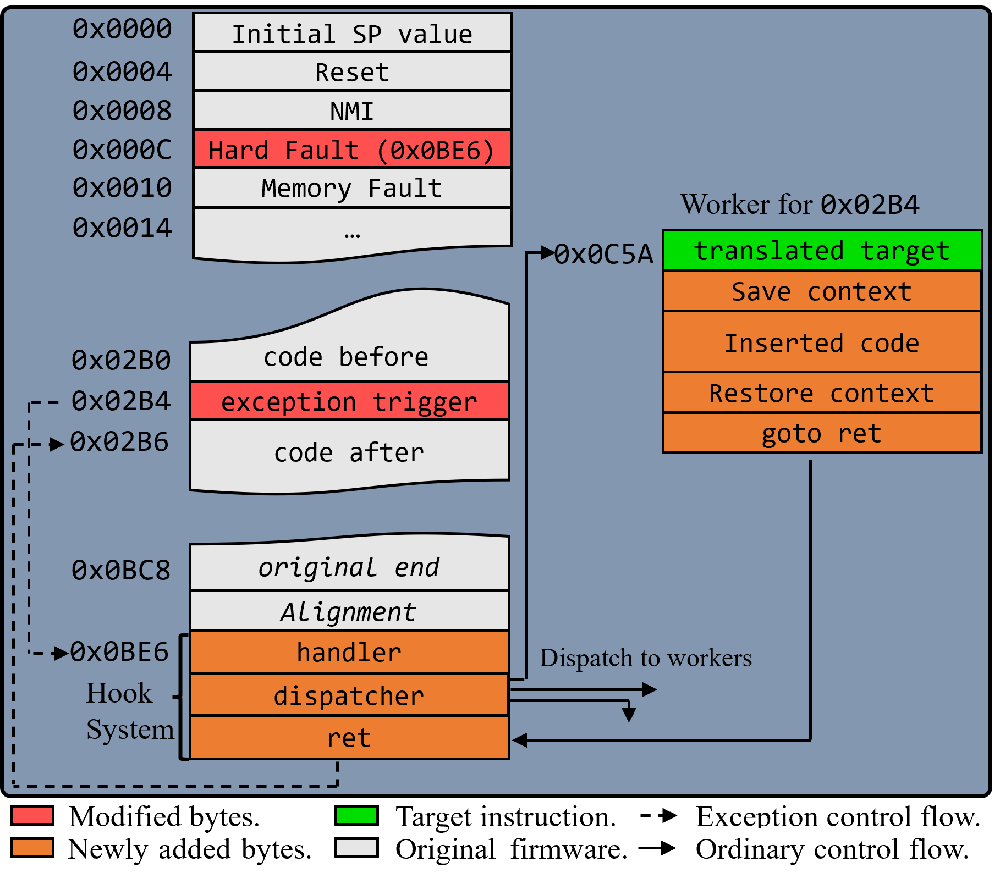
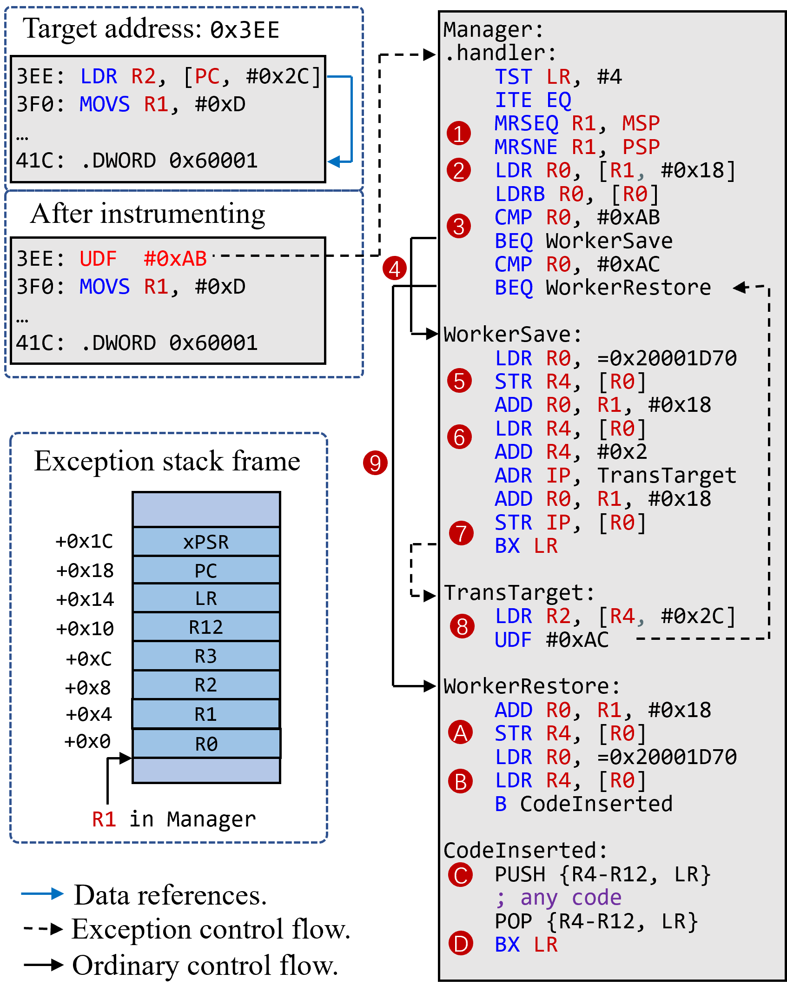

# PIFER

## Intro

A fine-grained static binary instrumenting framework for bare-metal ARM firmware.

## Install

1. Download/Clone the repository.
2. Install `GNU Arm Embedded Toolchain` on you OS and make sure the `arm-none-eabi*` tools exist in your `PATH`.
3. Install python dependencies `pip install -r requirements.txt`.
4. For test, `cd src && python example.py`

## Usage

`PIFER` is designed to provide basic instruction-level instrument functionality that can support any higher level applications. 

PIFER provides a easy-to-use python interfaces:

```python
import pifer

p = PIFER(bin_path=bin_path, img_base=img_base, arch=mcpu, compile_options=compile_options)

```

Note that the following parameters are required to initialize the object:

- `bin_path`: The path to the raw binary firmware (.bin) to be instrumented. 
  - If you have `.axf` or `.elf` only, use `arm-none-eabi-objcopy` to produce the `.bin` file.
- `img_base`: The address where the binary locate in the memory of the chip.
- `mcpu`: Target architecture (e.g., 'cortex-m4').
- `compile_options`: Extra compilation options. For example to hook FPU related instructions you may need to use: "-mfpu=fpv5-sp-d16 -mfloat-abi=hard"

Next, add the target addresses and corresponding instrument code using the `add_addr_and_payload(addr, payload)` interface.

```python
target_list = [0x07D4, 0x0806, 0x0832] 

for addr in target_list:
    payload = f"MOV R1, R1\n"
    p.add_addr_and_payload(addr, payload)
```

Finnaly, call the `patch` method to perform the instrumentation:

```python
p.patch()
```

Here's a complete example in [src/example.py](src/example.py), which instrument the blnky firmware for the LPC55S69-EVK.

<details><summary>example.py</summary>
<p>

```python
from pifer import *

# Configurations
bin_path = "../binaries/lpcxpresso55s69_led_blinky.bin"
img_base = 0
mcpu = "cortex-m33"
compile_options = "-mfpu=fpv5-sp-d16 -mfloat-abi=hard"
p = PIFER(bin_path=bin_path, img_base=img_base, arch=mcpu, compile_options=compile_options)

# Set the target
'''
.text:000007D4 80 B5                       PUSH            {R7,LR}

.text:00000806 0C 4B                       LDR             R3, =_data

.text:00000832 F5 E7                       B               loc_820
'''
target_list = [0x07D4, 0x0806, 0x0832] 

for addr in target_list:
    payload = f"MOV R1, R1\n"
    p.add_addr_and_payload(addr, payload)

p.patch()

print(f"Done")
```

</p>
</details>

## How it works



Speaking in a way that ignores the details:

1. Each instruction at the hooking address will be replaced with one that can raise an exception, and the corresponding handler will be replaced in the vector table with the newly added code.
2. In the handler we distinguish from which address the exception came from and jump to the corresponding code execution.
3. We find a way to correctly *replay* the execution of the patched instruction from a different location in the handler code, ensuring that the original program executes flawlessly. Refer to the paper for details.
4. Save the context and execute the inserted code.
5. Restore the context and return to original control flow. 

### Example

An example of the generated assembly by PIFER, targeting a Zephyr RTOS binary on Cortex-M4 is shown in the following figure:




In the example, the patch target is a PC relative addressing instruction `LDR` `R2`, [`PC`, `0x2C`], which is replaced with a `UDF` `0xAB`. When the program executes to `0x3EE`, the processor will transfer the control flow to the `.handler` (modified in the exception vector table).  

The bottom left shows the context saved by the processor. The hooking system manipulates its contents to control the context when returning from the exception mode, e.g. the return position (`PC`). The assembly code generated for this target is shown on the right side, where `0x20001D70` is the location of storage space located at the bottom of the stack memory. For simplicity we only demonstrate the single hooking case and remove the dispatcher. 

For instrumentation, you can add any instrument code between the step `C` and `D`.